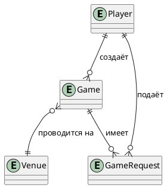
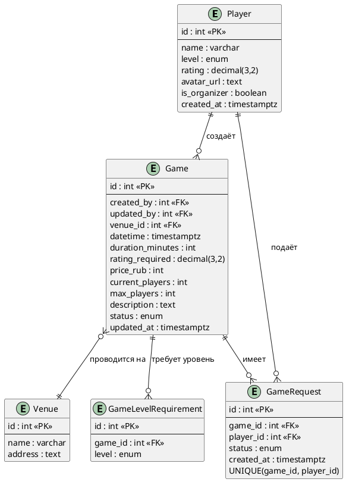
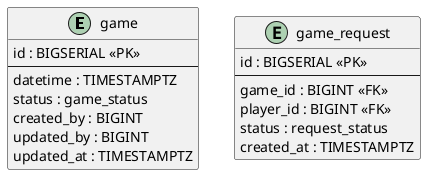
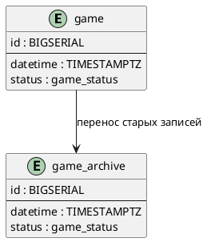
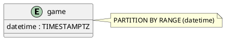

# ERD Диаграммы Sportnect

## Концептуальная модель

На концептуальном уровне выделены ключевые сущности предметной области и связи между ними без детализации атрибутов. Модель используется для обсуждения структуры системы.

Роль организатора в системе рассматривается как признак пользователя, а не как отдельная сущность.

---

## Логическая модель

Логическая модель содержит сущности, атрибуты, первичные и внешние ключи, а также кратности связей.

**Применены следующие паттерны:**

- **L1 (многие-ко-многим)** – связь между Player и Game реализована через таблицу GameRequest
- **L2 (enum)** – уровни игроков и статусы. ENUM выбран, так как набор значений фиксирован и не изменяется пользователями системы.

Для соблюдения 1NF поле `levels_allowed` вынесено в отдельную таблицу GameLevelRequirement, так как хранение массивов нарушает атомарность данных.

Модель приведена к 3NF: атрибуты площадки вынесены в отдельную сущность Venue.

---

## Физическая модель (ключевые решения)

### P4 — Индексация

Применён паттерн **P4 (индексация)** для оптимизации запросов.

**Индексы создаются на:**
- полях фильтрации (`status`)
- полях сортировки (`datetime`)
- внешних ключах (`game_id`, `player_id`, `created_by`)

Дополнительно введено ограничение **UNIQUE (game_id, player_id)**, предотвращающее дублирование заявок от одного игрока на одну игру.

---

### P3 — Архивирование

Применён паттерн **P3 (архивирование)**.

Игры со статусом `finished` старше 1 месяца переносятся в архивную таблицу. Это снижает нагрузку на основную таблицу и уменьшает размер индексов, что ускоряет выполнение запросов.

---

### Партиционирование

Таблица `game` партиционируется по полю `datetime` (по месяцам).

**Это позволяет:**
- ускорить выборки по диапазону дат
- уменьшить размер индексов
- повысить производительность range-запросов
- упростить процесс архивирования